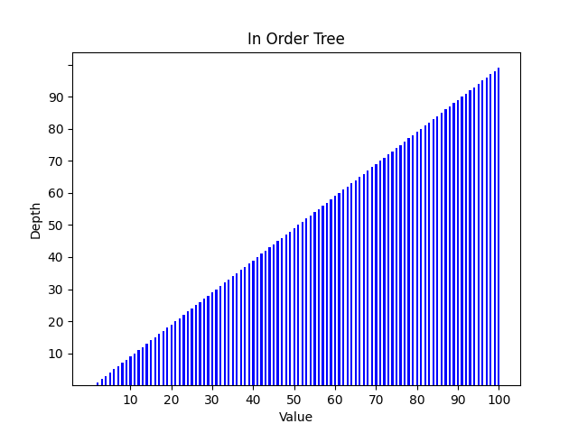
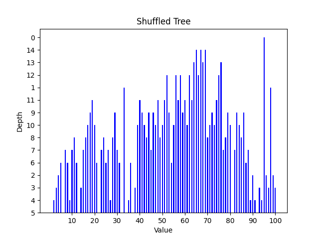
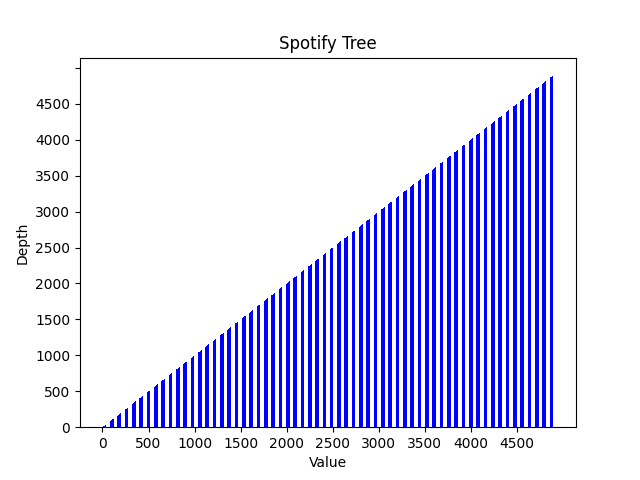
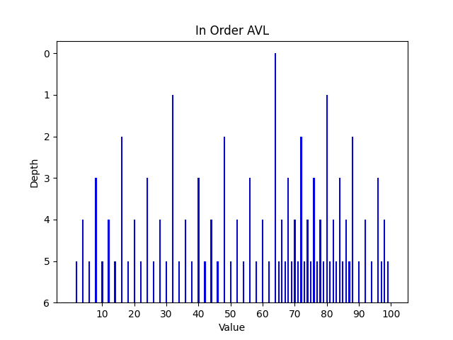
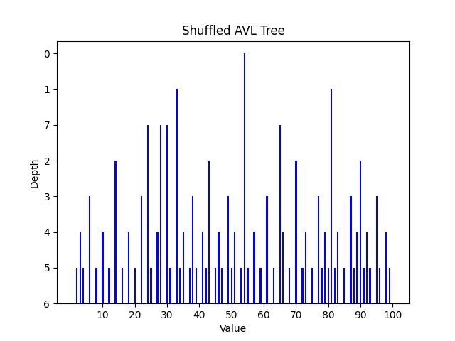
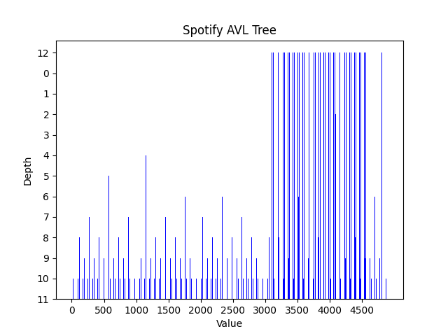
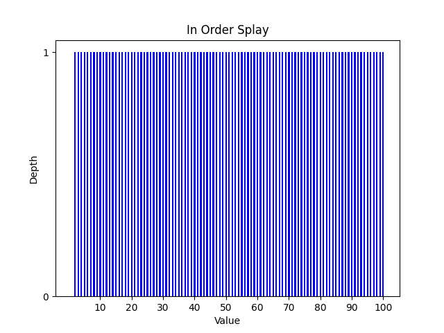
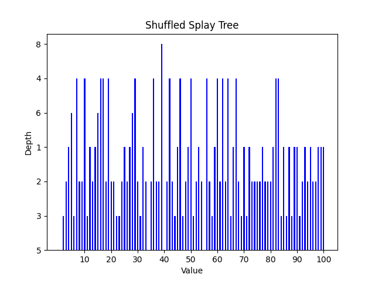

# Tree Performance Comprisons
This project is a combination of work from two different courses: Data Structures and Algorithms and Advanced Programming. It uses both C++ and Python.

All files other than Graphing.py originate from a Data Structures and algorithms project in which I compared the efficiency of AVL, Splay, and Binary Search Trees. I tested these algorithms sorting vectors of numbers, and sorting a vector of a custom data type, which I call "Spotify". This data type is created using a [data set]([url](https://www.kaggle.com/datasets/rakkesharv/spotify-top-10000-streamed-songs)) of the top 5,000 songs on Spotify based on streams.

The original project wrote the data to csv files, which I then used in Excel to create graphs of the findings. In Advanced Programming, the Graphing.py file was added, which uses Python's Matplotlib library to automatically generate graphs from the csv files that are created by the program.

The AVLTree, SplayTree, and BinarySearchTree files are largely written by Lisa Dion and Clayton Cafiero, professors of the Data Structures and Algorithms course. I have made small modifications which are documented in the header of those files. The Spotify header and cpp files are written entirely by me, and Graphing.py was written by a peer and I who worked together on the project.
## Binary Search Trees

### In order binary search tree
When values 1-100 are inserted in order to a binary search tree, the depth of each value in the tree is one less than
the value itself. Because each value added is greater than the last, the tree's structure is just a straight line. The
value of the root node is 1, as that was the first value added, so the depth of 1 is 0. The depth of the tree is one
less than the highest value. The last/highest value added to the tree is 100, so the depth of the tree is 99.

### Shuffled binary search tree
When values 1-100 are inserted in random order to a binary search tree, the depths will vary depending on the order of
insertion. Like the in order insertions, the value of the root node will be the first value inserted into the tree. The
depth of the tree will also change based on the order of insertions, but it will always be less than the depth of the
in order insertion tree. This is because each value added could either be less than or greater than the one before it,
so the structure of the tree will not be a straight line.

### Custom data type binary search tree
Using objects of the custom data type produces similar results to the in order insertions. The root node is the first
object inserted, and each value added after that will be in a straight line from the root node. The custom data type is
a chart of the top songs on Spotify, so each song has a position on the chart that is unique. So, the song at the #1
position will be the root node with a depth of 0. The rest of the songs will follow this pattern, with the depth being
one less than their position on the charts. Since there are 4,899 songs on the chart, the depth of the tree is 4,898.

## AVL Trees
### In order AVL tree
Because the AVL tree is self-balancing, the values will not remain in the same order they are inserted in. The root
node with a depth of 0 is 64. The depth of the tree will be much less than the binary tree, because the nodes will have
both left and right children. The depth of this tree is 6, while the BST's depth with the same values is 99.

### Shuffled AVL tree
Again, because the AVL tree is self-balancing, the values do not stay in the order they are inserted in. The root node
will change based on the order of insertion of the values. No matter the order of insertion, because the AVL preserves
the complete property, the depth will always be 7.

### Custom data type AVL tree
The AVL tree's self-balancing property again means that values will not remain in the same order they are inserted in.
The root node is the song at position 2048. The depth of the tree is 12, again much less than that of the BST with
depth 4,898.

## Splay Trees
### In order splay tree
In the splay tree, each time a node/value is found it is splayed to the root of the tree. The first node added will be
the root node, as we do not splay on add. Once the second value is found, it is splayed to the root, and the root node
becomes the left child of the new root. This pattern repeats, so the next node to be found is always the right child of
the root and the depth will always be 1. The depths will be much lower because values are splayed once they are
accessed.

### Shuffled splay tree
The depth of this splay tree will depend on the order of the values inserted. Because the values are inserted in random
order, unless the first value happens to be the root node, there is no way to tell what value is the root node from the
CSV file. This is because the root node will change everytime we find and splay a value.

### Custom data type splay tree
The splay tree of the custom data type is very similar to the in order insertion splay tree. The root node will again
be the first value inserted. The depth for every value after that will be 1, for the same reason as the in order tree.

